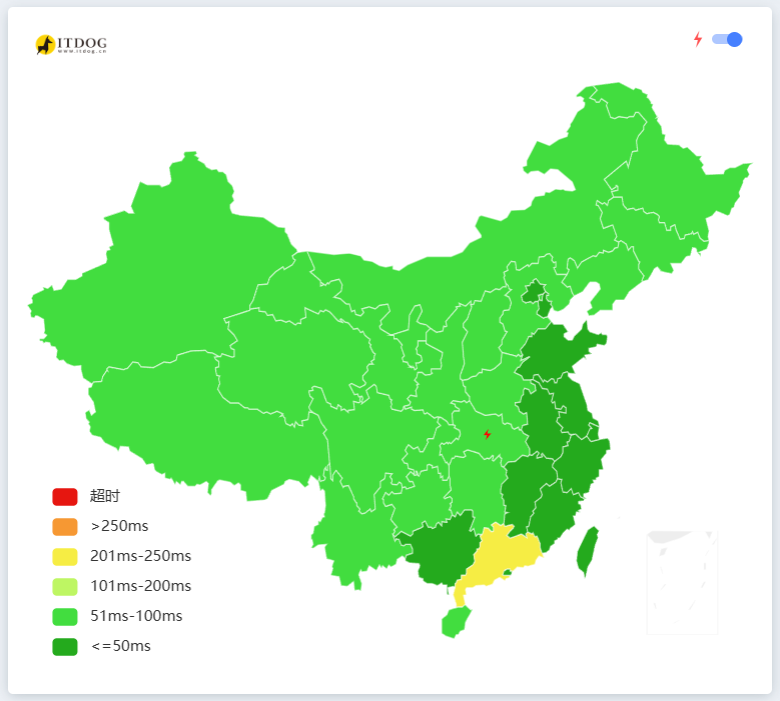

# OneDriveHosts

## 程序目的

通过指定OneDrive的网站的hosts，实现在封锁OneDrive的ip地址的区域使用OneDrive

## 程序来源

## 有关链接

- api.onedrive.com
- chi01pap001.storage.live.com

## 程序实现

在hosts文件内添加此文件内容：[点击跳转](/hosts)

若使用SwitchHosts工具：https://raw.githubusercontent.com/BlazeSnow/OneDriveHosts/main/hosts

SwitchHosts：https://github.com/oldj/SwitchHosts